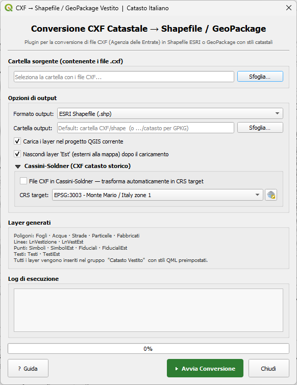

# CXF to Shape Vestito

Plugin QGIS per la conversione di file **CXF** (formato cartografico catastale italiano dell'Agenzia delle Entrate) in **Shapefile ESRI** o **GeoPackage** con stili QML preimpostati.



## Autore
Fortunato Amore

## Requisiti
- QGIS 3.20 o superiore
- Python 3.x (incluso in QGIS)

## Installazione
1. Comprimi la cartella `cxf2shp_vestito/` in un file `.zip`
2. Apri QGIS → **Plugin** → **Gestisci e installa plugin**
3. Vai sulla scheda **Installa da ZIP**
4. Seleziona il file `.zip` e clicca **Installa**

## Utilizzo
1. Vai su **Plugin** → **Catasto CXF** → **Converti CXF in Shapefile (Vestito)**
   *(oppure: **Vettore** → **Catasto CXF** → **Converti CXF in Shapefile (Vestito)**)*
2. Seleziona la cartella contenente i file `.cxf`
3. Scegli il formato di output: **ESRI Shapefile** (un file per layer) o **GeoPackage** (tutti i layer in un unico file `catasto.gpkg`)
4. (Opzionale) Seleziona la cartella di output con **Sfoglia…** (default: sottocartella `shape/` o `catasto/`)
5. Seleziona le opzioni desiderate
6. Per CXF catasto storico (Cassini-Soldner): espandi la sezione **"Cassini-Soldner (CXF catasto storico)"** e attiva il checkbox
7. Clicca **▶ Avvia Conversione**
8. Per la guida in linea clicca il pulsante **? Guida** in basso a sinistra

## Layer generati
| Layer | Tipo | Descrizione |
|---|---|---|
| Fogli | Poligono | Fogli catastali |
| Particelle | Poligono | Particelle catastali |
| Fabbricati | Poligono | Fabbricati |
| Acque | Poligono | Corpi idrici |
| Strade | Poligono | Strade |
| LnVestizione | Linea | Linee di vestizione interne |
| LnVestEst | Linea | Linee di vestizione esterne |
| Simboli | Punto | Simboli interni |
| SimboliEst | Punto | Simboli esterni |
| Fiduciali | Punto | Punti fiduciali interni |
| FiducialiEst | Punto | Punti fiduciali esterni |
| Testi | Punto | Testi interni |
| TestiEst | Punto | Testi esterni |

I layer vengono inseriti nel gruppo **"Catasto Vestito"** con stili QML preimpostati e ordinati dal basso verso l'alto per una corretta sovrapposizione visiva.

## Sistema di riferimento e Cassini-Soldner

Il plugin gestisce due famiglie di file CXF:

| Tipo | Periodo | Coordinate X tipiche | Come usare |
|---|---|---|---|
| Moderno | ~2010 → oggi | 1.100.000 – 2.900.000 | Autodetect EPSG:3003/3004 |
| Storico | precedente | ±poche migliaia | Attivare "Cassini-Soldner" + scegliere CRS target |

**Modalità CXF moderni (Roma 40 — autodetect):** il plugin rileva automaticamente la zona Gauss-Boaga dalla prima coordinata X del file:
- X < 2.000.000 → **EPSG:3003** (Monte Mario / Italy zone 1, nord-ovest Italia)
- X > 2.000.000 → **EPSG:3004** (Monte Mario / Italy zone 2, centro-sud Italia)

Il CRS rilevato viene riportato nel log e sovrascrive automaticamente la selezione manuale.

**Modalità Cassini-Soldner:** espandere la sezione avanzata e attivare il checkbox. Il plugin identifica automaticamente l'origine comunale dal codice nel file CXF, la cerca nella tabella bundled (`Italia_CS_PRJ_srtext.csv`, ~8.000 Comuni) e trasforma le coordinate nel CRS target scelto (EPSG:4326, EPSG:3003, UTM, ecc.). Il log riporta il codice catastale, il CRS target e la stringa PROJ usata per ogni foglio.

## Struttura file
```
cxf2shp_vestito/
├── __init__.py               # Entry point QGIS
├── metadata.txt              # Metadati plugin
├── cxf2shp_vestito_p.py      # Classe principale plugin
├── cxf2shp_vestito_d.py      # Dialog GUI + logica conversione
├── icon.png                  # Icona toolbar
├── help.html                 # Guida in linea (aperta dal pulsante "? Guida")
├── Italia_CS_PRJ_srtext.csv  # Origini Cassini-Soldner per ~8.000 Comuni
├── styles/                   # Stili QML per ogni layer
│   ├── Fogli.qml
│   ├── Particelle.qml
│   ├── Fabbricati.qml
│   ├── Acque.qml
│   ├── Strade.qml
│   ├── Testi.qml / TestiEst.qml
│   ├── Simboli.qml / SimboliEst.qml
│   ├── Fiduciali.qml / FiducialiEst.qml
│   └── LnVestizione.qml / LnVestEst.qml
└── README.md                 # Questa documentazione
```

## Changelog

### 2.0
- Autodetect CRS per CXF moderni (Roma 40): rileva automaticamente **EPSG:3003** o **EPSG:3004** dalla prima coordinata X del file (soglia 2.000.000 m)
- Il CRS rilevato sovrascrive la selezione manuale con log esplicito nel pannello di output

### 1.6
- Pulsante **? Guida** nel dialogo: apre la guida in linea da file esterno `help.html`
- Plugin aggiunto al menu **Plugin** oltre che a **Vettore**

### 1.5
- Supporto output **GeoPackage** (tutti i layer in un unico file `catasto.gpkg`)
- Selettore cartella di output con pulsante **Sfoglia…**
- Sezione Cassini-Soldner spostata in pannello avanzato collassabile (`QgsCollapsibleGroupBox`)

### 1.4
- Log del codice catastale individuato nel blocco MAPPA di ogni CXF (`Comune=X Foglio=N`)
- Log della stringa PROJ Cassini-Soldner utilizzata per la trasformazione
- Rilevamento duplicati `CodCata` nel CSV: warning con lista dei codici duplicati
- Stili QML aggiornati al formato QGIS 3.44.8-Solothurn (`styleCategories="Symbology"`, blocco `<selection>`, `<data_defined_properties>`)

### 1.3
- Supporto **Cassini-Soldner** (CXF catasto storico): trasformazione automatica in qualsiasi CRS target
- Lookup tabella bundled `Italia_CS_PRJ_srtext.csv` con origini per ~8.000 Comuni italiani
- Checkbox in UI per attivare la modalità Cassini-Soldner
- Label CRS dinamica: "CRS sorgente" (modalità normale) / "CRS target" (modalità CS)
- Warning se la tabella CS non è presente o il Comune non è trovato

### 1.2
- Aggiunto selettore CRS nella UI tramite `QgsProjectionSelectionWidget`
- Default EPSG:3003, supporto per qualsiasi CRS (incluso EPSG:3004 per il sud Italia)
- Il CRS scelto viene loggato e validato prima dell'avvio della conversione

### 1.1
- Stili QML spostati da codice inline a file esterni nella cartella `styles/`
- Il codice principale (`cxf2shp_vestito_d.py`) si riduce di ~340 righe
- Gli stili sono ora modificabili senza toccare il codice Python

### 1.0
- Rilascio iniziale
- Conversione CXF → Shapefile con 13 layer catastali
- Stili QML preimpostati per ogni layer
- Supporto multi-thread, progress bar e log di esecuzione
- Output in EPSG:3003 (Monte Mario / Italy zone 1)

## Licenza
GNU General Public License v2 o successiva (GPLv2+)
